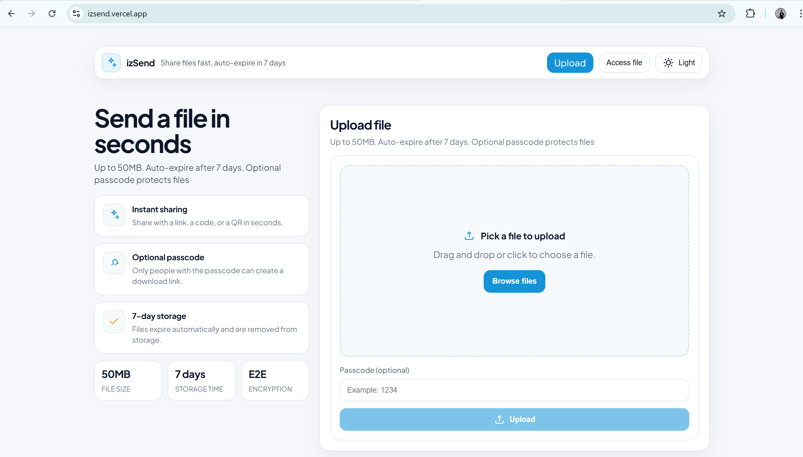

# izSend

izSend is a simple, self-hostable file sharing app with:

- Upload (max **50MB**)
- Share via **random slug link**, **short code**, or **QR**
- Optional **passcode** (protects link, code, and QR)
- Auto-expiration after **7 days** (expired objects are deleted from storage)

## Demo

- Live site: `https://izsend.vercel.app/` 

### Screenshots 

```md



```

## Table of contents

- [Features](#features)
- [How it works](#how-it-works)
- [Tech stack](#tech-stack)
- [Repository layout](#repository-layout)
- [Prerequisites](#prerequisites)
- [Getting started (local dev)](#getting-started-local-dev)
- [Configuration](#configuration)
- [Scripts](#scripts)
- [API reference](#api-reference)
- [Rate limiting](#rate-limiting)
- [Cleanup job (auto-delete)](#cleanup-job-auto-delete)
- [Deployment notes](#deployment-notes)
- [Troubleshooting](#troubleshooting)
- [Contributing](#contributing)
- [License](#license)

## Features

- **3 share modes**
  - Slug link: `/f/:slug`
  - Short code page: `/c/:code`
  - QR code (encodes the slug link)
- **Optional passcode**
  - If set during upload, it is required to generate a download link (presigned URL)
  - Passcodes are stored as a **bcrypt hash** (plaintext is never stored)
- **Storage TTL**
  - File records expire after **7 days**
  - A background cleanup job deletes expired objects from S3-compatible storage
- **Anti-spam**
  - IP-based rate limits on upload, metadata reads, and presign requests

## How it works

1. User uploads a file to the Fastify API (`POST /api/files`).
2. The API streams the bytes to S3-compatible storage and stores metadata in Neon Postgres.
3. The UI shows:
   - Slug link (`/f/:slug`)
   - Short code (`/c/:code`)
   - QR code (points to `/f/:slug`)
4. On the download page, the browser requests a presigned URL from the API (`POST /api/files/:id/presign`).
5. The API validates expiration + passcode (if required) and returns a **short-lived** presigned URL.
6. The browser downloads the file directly from S3-compatible storage.

This keeps the API lightweight for downloads while still allowing passcode enforcement at the “create download link” step.

## Tech stack

- **Backend**: Node.js + TypeScript + Fastify
- **Database**: Neon Postgres (`pg` client)
- **Object storage**: S3-compatible (AWS S3 / Cloudflare R2 / MinIO)
- **Frontend**: React + Vite + React Router
- **QR**: `qrcode.react`

## Repository layout

```text
.
├─ apps/
│  ├─ api/          # Fastify API (upload, metadata, presign, cleanup job)
│  └─ web/          # React UI (upload page, download pages)
├─ docs/            # Design notes
├─ .env.example     # Backend env example (repo root)
└─ README.md
```

## Prerequisites

- Node.js **20+** (Node 22 recommended)
- An S3-compatible bucket (AWS S3 / Cloudflare R2 / MinIO)
- A Neon Postgres connection string

## Getting started (local dev)

### 1) Install dependencies

```bash
npm install
```

### 2) Configure environment variables

The API reads environment variables from **repo root** `.env`.

```bash
cp .env.example .env
```

Then edit `.env` (see [Configuration](#configuration)).

### 3) Initialize the database schema

```bash
npm run db:init
```

This runs `apps/api/scripts/dbInit.ts` and executes `apps/api/sql/schema.sql` on your Neon database.

### 4) Run both API + Web

```bash
npm run dev
```

- Web: `http://localhost:5173`
- API: `http://localhost:3000`

## Configuration

### Backend (`.env` at repo root)

Copy `.env.example` to `.env` and fill in the values:

| Variable | Required | Default | Description |
|---|---:|---:|---|
| `API_PORT` | no | `3000` | API port |
| `WEB_ORIGIN` | no | `http://localhost:5173` | Allowed CORS origin for the web app |
| `PRESIGN_TTL_SECONDS` | no | `300` | Presigned download URL TTL (seconds) |
| `FILE_TTL_DAYS` | no | `7` | File expiration (days) |
| `CLEANUP_INTERVAL_MINUTES` | no | `60` | Cleanup job interval (minutes) |
| `AWS_ACCESS_KEY_ID` | yes | - | S3 credentials |
| `AWS_SECRET_ACCESS_KEY` | yes | - | S3 credentials |
| `AWS_REGION` | yes | - | S3 region (or `auto` for some providers) |
| `S3_BUCKET` | yes | - | Bucket name |
| `S3_ENDPOINT` | no | - | Custom S3 endpoint (R2/MinIO) |
| `S3_FORCE_PATH_STYLE` | no | `false` | Use path-style addressing (often required for MinIO) |
| `NEON_CONNECTION_STRING` | yes | - | Neon Postgres connection string |

**Upload size limit**: hard-capped at **50MB** in `apps/api/src/env.ts`.

### Backend (production)

In production you typically **do not** ship a `.env` file. Set environment variables in your host (e.g. Render).

- Production template: `.env.production.example` (do not put secrets in git)
- The API code reads `process.env` and will work without a `.env` file

#### Example: AWS S3

```bash
AWS_ACCESS_KEY_ID=...
AWS_SECRET_ACCESS_KEY=...
AWS_REGION=ap-southeast-1
S3_BUCKET=your-bucket
S3_ENDPOINT=
S3_FORCE_PATH_STYLE=false
```

#### Example: Cloudflare R2 (S3-compatible)

```bash
AWS_ACCESS_KEY_ID=...
AWS_SECRET_ACCESS_KEY=...
AWS_REGION=auto
S3_BUCKET=your-bucket
S3_ENDPOINT=https://<accountid>.r2.cloudflarestorage.com
S3_FORCE_PATH_STYLE=true
```

#### Example: MinIO (local)

```bash
AWS_ACCESS_KEY_ID=minioadmin
AWS_SECRET_ACCESS_KEY=minioadmin
AWS_REGION=us-east-1
S3_BUCKET=izsend
S3_ENDPOINT=http://localhost:9000
S3_FORCE_PATH_STYLE=true
```

### Frontend (`apps/web/.env`)

Copy `apps/web/.env.example` if needed:

```bash
cp apps/web/.env.example apps/web/.env
```

| Variable | Required | Default | Description |
|---|---:|---:|---|
| `VITE_API_BASE_URL` | no | `http://localhost:3000` | Base URL for the API |

### Frontend (production)

On Vercel, set:

- `VITE_API_BASE_URL` = your deployed API URL (Render)

Production template: `apps/web/.env.production.example`

## Scripts

From repo root:

| Command | What it does |
|---|---|
| `npm run dev` | Runs API + Web together |
| `npm run dev:api` | Runs only the API |
| `npm run dev:web` | Runs only the web app |
| `npm run db:init` | Initializes Postgres schema (Neon) |
| `npm run build` | Builds API + Web |
| `npm run start` | Starts the API from `apps/api/dist` |

## API reference

Base URL: `http://localhost:3000`

### `POST /api/files`

Multipart form:

- `file` (required)
- `passcode` (optional, 4–64 chars)

Response (shape):

```json
{
  "id": "uuid",
  "slug": "string",
  "code": "string",
  "originalName": "string",
  "contentType": "string",
  "sizeBytes": 123,
  "expiresAt": "2026-01-01T00:00:00.000Z",
  "requiresPasscode": false,
  "share": { "slugPath": "/f/...", "codePath": "/c/..." }
}
```

### `GET /api/files/slug/:slug`

Returns public metadata for the file (404 if not found, 410 if expired).

### `GET /api/files/code/:code`

Returns public metadata for the file by short code (code is uppercased server-side).

### `POST /api/files/:id/presign`

Request:

```json
{ "passcode": "optional" }
```

Response:

```json
{ "url": "https://..." }
```

Common errors:

- `401 { "error": "Passcode required" }`
- `403 { "error": "Invalid passcode" }`
- `410 { "error": "Expired" }`
- `404 { "error": "Not found" }`

## Rate limiting

The API uses `@fastify/rate-limit` and applies limits per route:

- `POST /api/files`: 10/min (stricter)
- `GET /api/files/*`: 120/min
- `POST /api/files/:id/presign`: 60/min

You can adjust limits in `apps/api/src/routes/files.ts`.

## Cleanup job (auto-delete)

The API runs a periodic cleanup job (`apps/api/src/jobs/cleanupExpired.ts`) that:

1. Finds records where `expires_at < now()` and `deleted_at IS NULL`
2. Deletes the object from S3-compatible storage
3. Sets `deleted_at = now()`

It runs once on startup and then every `CLEANUP_INTERVAL_MINUTES` (default: 60).

## Deployment notes

This repo does not include Docker manifests yet. A common setup is:

- **Backend** on Render: `apps/api`
- **Frontend** on Vercel: `apps/web`
- S3-compatible object storage + Neon Postgres

Minimum production checklist:

- Keep `.env` out of git (already in `.gitignore`)
- Use a dedicated S3 bucket with least-privilege credentials
- Set `WEB_ORIGIN` to your real frontend URL (Vercel origin)
- Consider tightening rate limits

### Quick deploy (Render + Vercel)

1) Deploy API to Render

- Build: `npm ci && npm run build --workspace apps/api`
- Start: `npm run start --workspace apps/api`
- Set env vars (see `.env.production.example`)

2) Deploy Web to Vercel

- Root directory: `apps/web`
- Set `VITE_API_BASE_URL` to your Render API URL
- Ensure SPA rewrites are enabled for React Router (this repo includes `apps/web/vercel.json`)

3) Update API CORS

- Set Render `WEB_ORIGIN` to your Vercel URL

> Tip: you can keep a personal deploy checklist in `docs/DEPLOY_PRIVATE.md` (gitignored).

## Troubleshooting

### “Missing env var: S3_BUCKET” (or similar)

The API reads `.env` from the **repo root**. Ensure `.env` exists and is populated.

### Upload hangs / nothing in DB

If S3 upload fails, the API will not insert a DB record. Check API logs first.

### Bucket must be addressed using the specified endpoint

This usually means region/endpoint mismatch.

- AWS S3: verify `AWS_REGION` matches the bucket region
- R2/MinIO: set `S3_ENDPOINT` and often `S3_FORCE_PATH_STYLE=true`

### “File too large”

Upload is capped at **50MB** (Fastify multipart limit).

### Wrong passcode

The API returns `403 Invalid passcode`. The UI surfaces this as an error message on the download page.

## Contributing

Issues and PRs are welcome. Keep changes focused and avoid adding secrets to the repo.

## License

No license file is included yet. If you’re open-sourcing this, add a `LICENSE` (MIT/Apache-2.0/GPL/etc.) and reference it here.
